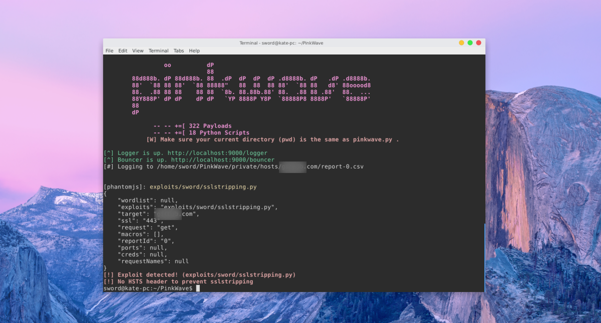

PinkWave
==========




PinkWave is a pentesting tool for linux which can be used to test (web)servers with custom scripts and Selenium.

## Features
### Perform custom vulnerability scans using Python + Browsers
Using the Seleniun Webdriver, PinkWave can use browsers
like Firefox, Chrome or PhantomJS to perform automated vulnerability scans. 

Python scripts can control the browser with an easy to use browser [API](docs/devleopers/extensions_request.markdown) to perform actions and report vulnerabilities.

### User flow 
PinkWave can execute other tasks before performing an '**exploit**' using other python scripts called '**macros**'. Example: use a '**macro**' to login before performing an '**exploit**'.


### Logging
All scans will be logged in the private/ directory separately for each (sub)domain/ip address.


# Installing
Clone this repository and follow the following steps:

### 1\. Install dependencies
```
# Install python dependencies
cd PinkWave
pip install -r requirements.txt

# (optional) Install cipherscan if you want to use /exploits/sword/cipherscan.py
cd pw_modules
git clone https://github.com/mozilla/cipherscan/
```

### 2\. Install webdriver
Read more in [drivers/README.md](drivers/)

### 3\. Allow `sudo nmap` for current user
Allow nmap to run as root for your current user to use privileged scans.

```
# Open sudoers file
sudo visudo

# Append this line and replace [YOURUSERNAME] with your username
[YOURUSERNAME] ALL = NOPASSWD: /usr/bin/nmap
# type :wq to exit and save
```

## Usage

#### #1\. Run exploit
Use pinkwave.py to execute a single exploit. See **#4.** for params.  
```
./pinkwave.py -t [target] -e [exploit] [params]
```

#### #2\. Run multiple exploits via JSON
Use [automate.py](docs/administrators/automate-tests.markdown) to execute multiple tests with a [JSON file](docs/administrators/automate-tests.markdown).
```/
./automate.py [pathToTestfile]
```

#### #3\. Status interface (s)
View status of the PinkWave tool and test the http-port for XSS audits and POST form generators: 
```
./pinkwave.py --status
[*] PinkServer (HTTP server) starting on port: 9000


             oo          dP                                             
                         88                                             
    88d888b. dP 88d888b. 88  .dP  dP  dP  dP .d8888b. dP   .dP .d8888b. 
    88'  `88 88 88'  `88 88888"   88  88  88 88'  `88 88   d8' 88ooood8 
    88.  .88 88 88    88 88  `8b. 88.88b.88' 88.  .88 88 .88'  88.  ... 
    88Y888P' dP dP    dP dP   `YP 8888P Y8P  `88888P8 8888P'   `88888P' 
    88                                                                  
    dP                                                                  

              -- -- +=[ 322 Payloads 
              -- -- +=[ 17 Python Scripts 
            [W] Make sure your current directory (pwd) is the same as pinkwave.py .
            
[^] Logger is up. http://localhost:9000/logger
[^] Bouncer is up. http://localhost:9000/bouncer
```

#### #4\.  Exploit interface (-e)
Use the -e parameter with a path to an exploit to display the parameters.

```
./pinkwave.py -e exploits/sword/sslstripping.py

[exploits/sword/sqlinjection.py] > show parameters

Exploit options (exploits/sword/sqlinjection.py)

[--target] (Required) Remote target host
[--requestNames] POST/GET names, comma seperated
[--request] (optional) Specify request type (GET,POST or POST/DIRECT)
```

#### #5\. Macro interface (-m)
Use the -m parameter with paths(comma seperated) to execute macros.

```
/pinkwave.py -m tests/example-macros/logmein.py,tests/example-macros/searchforuser.py
[*] PinkServer (HTTP server) starting on port: 9000
Logging in as admin before performing action
Logged in!
Searching for user Iron Man(1)...


<tr>
<td>1</td>
<td>Iron</td>
<td>Man</td>
</tr>

```


## Examples usage
**Testing for SSL stripping**:
```
./pinkwave.py -t localhost -e exploits/sword/sslstripping.py
# [!] Exploit detected! (exploits/sword/sslstripping.py)
# [!] No HSTS header to prevent sslstripping
```

**Testing expected open TCP ports**:
```
./pinkwave.py -t localhost -e exploits/sword/portscantcp.py --ports=80,443
# [!] Exploit detected! (exploits/sword/portscantcp.py)
# [!] Unexpected open/closed ports: 9000, 443, 53
```


## Documentation
See [docs/](docs/) for documentation.

## Contributing
You can fork this repository and add your own **exploit** directory, which we can add to this repository. Include the \_\_author\_\_ headers in your python scripts.


## Credits, copyright and license
PinkWave is developed for PinkRoccade Local Government and developed by [Maarten Schermer](https://github.com/maartensch) during his security internship in 2016.

Code and documentation copyright 2017 PinkRoccade Local Government. Code released under the [Apache 2 License](LICENSE). Docs released under [Creative Commons](docs/LICENSE).
